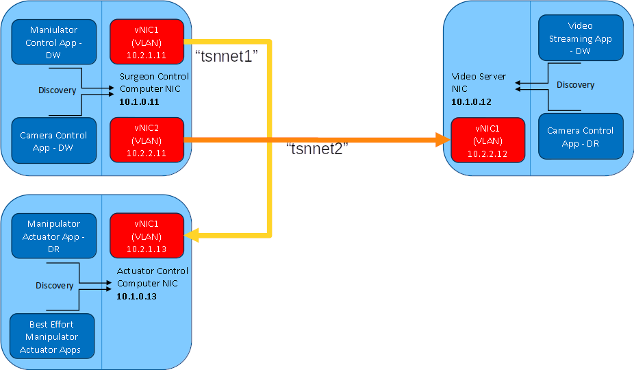

# TSN Simulator based on Docker containers 

The intention is to simulate a distributed application using RTI Connext whose
DataWriters and DataReader communicate via specific VLANs leaving discovery and
meta-traffic sent and received over the non-VLAN network.

## Cloning the repository

To clone the repository you will need to run `git clone` as follows to download
both the repository and its submodule dependencies:

```bash
git clone --recurse-submodule https://github.com/rticommunity/rticonnextdds-usecases-tsn-arch-sim.git
```

If you forget to clone the repository with `--recurse-submodule`, simply run
the following command to pull all the dependencies:

```bash
git submodule update --init --recursive
```

## Build Connext Docker image

The initial step in this Case+Code is to configure a Docker image, which will
serve as a node within the application architecture. During the image build process,
the applications associated with this Case+Code will be automatically compiled and
included inside the Docker image. These applications will be accessible in the
resulting image at the `/root/app/` directory."

There is a docker file in the `docker` subdirectory. To create the docker image
adjust the line in the Dockerfile that reads `ENV TZ=Europe/Madrid` to set the
correct timezone, then run the following command to build the Connext image for
the 7.3.0 release, take into account that you are accepting the RTI license
agreement by setting the `RTI_LICENSE_AGREEMENT_ACCEPTED` argument to "accepted":

```bash
docker build -t connext:7.3.0 -f docker/Dockerfile --build-arg RTI_LICENSE_AGREEMENT_ACCEPTED=accepted --build-arg CONNEXT_VERSION=7.3.0 .
```


If you want to target a different version of Connext, then you must set the following
arguments to match your requirements 

- CONNEXT_VERSION: supported values are 7.3.0 and 6.1.2

Here's an example of what that would look like for a 6.1.2 release:

```bash
docker build -t connext:6.1.2 -f docker/Dockerfile --build-arg RTI_LICENSE_AGREEMENT_ACCEPTED=accepted --build-arg CONNEXT_VERSION=6.1.2 .
```

## Networks

The docker images will be using bridged networking. For that propose we are going
to create three different networks the `stdnet` used for discovery and meta-traffic
and two networks added to simulate VLANs `tsnnet1` and `tsnnet2`. To create these
docker networks, run

```bash
docker network create --subnet=10.1.0.0/24 stdnet
docker network create --subnet=10.2.1.0/24 tsnnet1
docker network create --subnet=10.2.2.0/24 tsnnet2
```

## Application configuration

The application will consist of three nodes based on the ShapeTypeExtended type
used by ShapesDemo. An Orange sample will represent video command data, and Cyan
samples will be used to represent effector command data. The samples differ in
colour to permit easy visualisation in WireShark. Below is a summary of the
three applications and their network configurations.



### Surgeon Console

- discovery/meta-traffic: `10.1.0.11`  
- Console/Effector VLAN (tsnnet1): `10.2.1.11`  
- Console/Video VLAN (tsnnet2): `10.2.2.11`  

The "Surgeon Console" has two data writers, one to send commands to the "Video
Server" (Orange) and one to send commands to the "Effector Server" (Cyan).

### Video Server

- discovery/meta-traffic: `10.1.0.12`  
- Console/Video VLAN (tsnnet2): `10.2.2.12`  

The DataReader in the "Video Server" will receive samples via the tsnnet2 network.

### Effector Server

- discovery/meta-traffic: `10.1.0.13`  
- Console/Effector VLAN (tsnnet1): `10.2.1.13  

The DataReader in the "Effector Server" will receive samples via the tsnnet1 network.

## Starting the docker containers

The default configuration used for the development of this simulation is to share
the display with an X server to allow ShapesDemo to be executed from within the
container and rendered on the host's display. 

If this isn't required, remove the `-e DISPLAY`, `-v $XAUTHORITY:/root/.Xauthority`
and `-v /tmp/.X11-unix:/tmp/.X11-unix` parameters from the provided docker run commands.

### Surgeon Console

In a terminal window run:  

```bash
docker run --rm -it -e DISPLAY --privileged --network stdnet --ip 10.1.0.11 --hostname surgeon_console --name surgeon_console -v $XAUTHORITY:/root/.Xauthority -v /tmp/.X11-unix:/tmp/.X11-unix -v $RTI_LICENSE_FILE:/root/rti_license.dat connext:7.3.0 bash
```

In a separate terminal window run the following commands to connect the "Surgeon
Console" container to the tsnnet1 and tsnnet2 networks:

```bash
docker network connect tsnnet1 --ip 10.2.1.11 surgeon_console
docker network connect tsnnet2 --ip 10.2.2.11 surgeon_console
```

Run `ip a` in the "Surgeon Console" terminal to verify the network configuration:

```bash
root@surgeon_console:~# ip a
1: lo: <LOOPBACK,UP,LOWER_UP> mtu 65536 qdisc noqueue state UNKNOWN group default qlen 1000
    link/loopback 00:00:00:00:00:00 brd 00:00:00:00:00:00
    inet 127.0.0.1/8 scope host lo
       valid_lft forever preferred_lft forever
108: eth0@if109: <BROADCAST,MULTICAST,UP,LOWER_UP> mtu 1500 qdisc noqueue state UP group default 
    link/ether 02:42:ac:11:00:03 brd ff:ff:ff:ff:ff:ff link-netnsid 0
    inet 10.1.0.11/24 brd 10.1.0.255 scope global eth0
       valid_lft forever preferred_lft forever
110: eth1@if111: <BROADCAST,MULTICAST,UP,LOWER_UP> mtu 1500 qdisc noqueue state UP group default 
    link/ether 02:42:c0:a8:01:0b brd ff:ff:ff:ff:ff:ff link-netnsid 0
    inet 10.2.1.11/24 brd 10.2.1.255 scope global eth1
       valid_lft forever preferred_lft forever
112: eth2@if113: <BROADCAST,MULTICAST,UP,LOWER_UP> mtu 1500 qdisc noqueue state UP group default 
    link/ether 02:42:c0:a8:02:0b brd ff:ff:ff:ff:ff:ff link-netnsid 0
    inet 10.2.2.11/24 brd 10.2.2.255 scope global eth2
       valid_lft forever preferred_lft forever
```

### Video Server

In a new terminal window run:  

```bash
docker run --rm -it -e DISPLAY --privileged --network stdnet --ip 10.1.0.12 --hostname video_server --name video_server -v $XAUTHORITY:/root/.Xauthority -v /tmp/.X11-unix:/tmp/.X11-unix -v $RTI_LICENSE_FILE:/root/rti_license.dat connext:7.3.0 bash
```

In a separate terminal window run the following command to connect the "Video
Server" container to the tsnnet2 network:  

```bash
docker network connect tsnnet2 --ip 10.2.2.12 video_server
```

Run `ip a` in the "Video Server" terminal to verify the network configuration:  

```bash
root@video_server:~# ip a
1: lo: <LOOPBACK,UP,LOWER_UP> mtu 65536 qdisc noqueue state UNKNOWN group default qlen 1000
    link/loopback 00:00:00:00:00:00 brd 00:00:00:00:00:00
    inet 127.0.0.1/8 scope host lo
       valid_lft forever preferred_lft forever
114: eth0@if115: <BROADCAST,MULTICAST,UP,LOWER_UP> mtu 1500 qdisc noqueue state UP group default 
    link/ether 02:42:ac:11:00:04 brd ff:ff:ff:ff:ff:ff link-netnsid 0
    inet 10.1.0.12/24 brd 10.1.0.255 scope global eth0
       valid_lft forever preferred_lft forever
116: eth1@if117: <BROADCAST,MULTICAST,UP,LOWER_UP> mtu 1500 qdisc noqueue state UP group default 
    link/ether 02:42:c0:a8:02:0c brd ff:ff:ff:ff:ff:ff link-netnsid 0
    inet 10.2.2.12/24 brd 10.2.2.255 scope global eth1
       valid_lft forever preferred_lft forever
```

### Effector Server

In a new terminal window run:  

```bash
docker run --rm -it -e DISPLAY --privileged --network stdnet --ip 10.1.0.13 --hostname effector_server --name effector_server -v $XAUTHORITY:/root/.Xauthority -v /tmp/.X11-unix:/tmp/.X11-unix -v $RTI_LICENSE_FILE:/root/rti_license.dat connext:7.3.0 bash
```

In a separate terminal window run the following command to connect the "Effector
Server" container to the tsnnet2 network:  

```bash
docker network connect tsnnet1 --ip 10.2.1.13 effector_server
```

Run `ip a` in the "Effector Server" terminal to verify the network configuration:  

```bash
root@effector_server:~# ip a
1: lo: <LOOPBACK,UP,LOWER_UP> mtu 65536 qdisc noqueue state UNKNOWN group default qlen 1000
    link/loopback 00:00:00:00:00:00 brd 00:00:00:00:00:00
    inet 127.0.0.1/8 scope host lo
       valid_lft forever preferred_lft forever
118: eth0@if119: <BROADCAST,MULTICAST,UP,LOWER_UP> mtu 1500 qdisc noqueue state UP group default 
    link/ether 02:42:ac:11:00:05 brd ff:ff:ff:ff:ff:ff link-netnsid 0
    inet 10.1.0.13/24 brd 10.1.0.255 scope global eth0
       valid_lft forever preferred_lft forever
120: eth1@if121: <BROADCAST,MULTICAST,UP,LOWER_UP> mtu 1500 qdisc noqueue state UP group default 
    link/ether 02:42:c0:a8:01:0d brd ff:ff:ff:ff:ff:ff link-netnsid 0
    inet 10.2.1.13/24 brd 10.2.1.255 scope global eth1
       valid_lft forever preferred_lft forever
```

## Usage

The three applications have the same usage:

```bash
Usage:
    -d, --domain       <int>   Domain ID this application will
                               subscribe in.  
                               Default: 0
    -q, --qos_file     <str>   XML file containing QoS profiles
                               for the application.
                               Required: True
    -s, --sample_count <int>   Number of samples to receive before
                               cleanly shutting down. 
                               Default: infinite
    -v, --verbosity    <int>   How much debugging output to show.
                               Range: 0-3 
                               Default: 1
```

-   Surgeon Console:

    ```bash
    /root/app/surgeon_console -q /root/app/surgeon_qos_profiles.xml
    ```

-   Video Server:  

    ```bash
    /root/app/video_server -q /root/app/video_qos_profiles.xml
    ```

-   Effector Server:  

    ```bash
    /root/app/effector_server -q /root/app/effector_qos_profiles.xml
    ```

## Quality of Service

The three applications have distinct QoS profiles, but they all follow a common theme. 
The base `tsn_profile` sets up and configures UDP transports which are given
aliases defined as stdnet, tsnnet1 and tsnnet2. Only all three are defined in the
"Surgeon Console" QoS, the other applications define only those that are used in
their specific cases.

The transport_builtin QoS is set to MASK_NONE, meaning no builtin transports are
enabled which ensures the traffic only goes through those registered.

Discovery is configured to use the transport defined with the alias "stdnet",
which is the default docker bridge network. The initial peers are configured,
as in a TSN scenario using VLANs it would be expected to know the addresses, and
accept_unknown_peers is set to false.

### Surgeon Console

In the "Surgeon Console" QoS, two additional profiles are defined, both deriving
from `tsn_profile`. The first, `video_profile` configures the DataWriter for the
`video_control` topic to use the transport with the `tsnnet2` alias, while the 
second `effector_profile` configures the DataWriter for the `effector control`
topic to use the transport with the `tsnnet1` alias.

### Video Server

In the "Video Server" QoS, the discovery configuration differs in that only the
"Surgeon Console" node is defined in the peer list.
The transport configuration also differs, as the transport with the alias `stdnet`
is using the address docker assigned to the default bridge network (10.1.0.12),
and the `tsnnet1` transport is absent as it is not used by the "Video Server".

In the `video_profile` QoS profile, the DataReader is configured to use the `tsnnet2`
transport, and additionally the unicast endpoint is defined as using the `tsnnet2`
transport and the specific receive port (2345). (This port can be anything as long
as it doesn't conflict with those defined for builtin transports)

### Effector Server

In the "Effector Server" QoS, the discovery configuration again differs from that
of the "Surgeon Console" in the discovery configuration. The transport configuration
again differs, as the transport with the alias `stdnet` is using the address docker
assigned to the default bridge network (10.1.0.13), and the `tsnnet2` transport is
absent as it is not used by the "Effector Server".

In the `effector_profile` QoS profile, the DataReader is configured to use the `tsnnet1`
transport, and additionally the unicast endpoint is defined as using the `tsnnet1`
transport and the specific receive port (1234).

## Building the applications

If you want to build the applications from source in your local machine, you will
need to have Connext, CMake and review the [Building Applications](https://community.rti.com/static/documentation/connext-dds/7.3.0/doc/manuals/connext_dds_professional/platform_notes/platform_notes/BuildingApplications.htm#Chapter_2_Building_Applications%E2%80%94Notes_for_All_Platforms)
documentation section. The applications have been tested with Connext 7.3.0 and 6.1.2.

Create a build directory and run `cmake` to build as follows:

```bash
mkdir build 
cd build
cmake ..
cmake --build .
```

You can run your own builded applications by running the distribute script from the
build directory and then the three applications should be ready to be executed from
within the docker containers from the `/root/app` folder.
